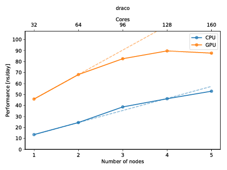

.. MDBenchmark documentation master file, created by
   sphinx-quickstart on Mon Feb 26 17:06:54 2018.
   You can adapt this file completely to your liking, but it should at least
   contain the root `toctree` directive.

MDBenchmark: Benchmark molecular dynamics simulations
=====================================================

.. image:: https://img.shields.io/pypi/v/mdbenchmark.svg
    :target: https://pypi.python.org/pypi/mdbenchmark

.. image:: https://anaconda.org/conda-forge/mdbenchmark/badges/version.svg
    :target: https://anaconda.org/conda-forge/mdbenchmark

.. image:: https://img.shields.io/pypi/l/mdbenchmark.svg
    :target: https://pypi.python.org/pypi/mdbenchmark

.. image:: https://travis-ci.org/bio-phys/MDBenchmark.svg?branch=develop
    :target: https://travis-ci.org/bio-phys/MDBenchmark

.. image:: https://codecov.io/gh/bio-phys/MDBenchmark/branch/develop/graph/badge.svg
    :target: https://codecov.io/gh/bio-phys/MDBenchmark

.. image:: https://img.shields.io/badge/PRs-welcome-brightgreen.svg?style=flat-square
    :target: http://makeapullrequest.com

.. image:: https://zenodo.org/badge/112506401.svg
    :target: https://zenodo.org/badge/latestdoi/112506401

---------------

**MDBenchmark** — quickly generate, start and analyze benchmarks for your molecular dynamics simulations.

MDBenchmark is a tool to squeeze the maximum out of your limited computing
resources. It tries to make it as easy as possible to set up systems on varying
numbers of nodes and compare their performances to each other.

You can also create a plot to get a quick overview of the possible performance
(and show of to your friends)! The plot below shows the performance of an
molecular dynamics system on up to five nodes with and without GPUs.

Quick start
===========

Follow the next two paragraphs to get a quick start. Extended usage guides can
be found below. You can install ``mdbenchmark`` with your favorite Python
package manager. Afterwards you are ready to use ``mdbenchmark``.

Install
-------

If you are familiar with the usual way of installing python packages, just use
``pip``::

  pip install mdbenchmark

Anaconda users can install via ``conda``::

  conda install -c conda-forge mdbenchmark

Cutting-edge users may prefer ``pipenv``::

  pipenv install mdbenchmark

Usage
-----

Now that the package is installed, you can generate benchmarks for your system.
Assuming you want to benchmark a GROMACS 2018.3 simulation on up to 5 nodes,
with the TPR file called ``md.tpr``, run the following command::

  mdbenchmark generate -n md --module gromacs/2018.3 --max-nodes 5

After generation benchmarks can be submitted::

  mdbenchmark submit

Now, you can also monitor the status of your benchmark with ``mdbenchmark``.
This will show you the performance of all runs that have finished. If you only wish to view
the data you can omit the ``--save-csv`` flag::

  mdbenchmark analyze --save-csv data.csv

Finally, you can plot the data from your ``data.csv`` file with::

  mdbenchmark plot --csv data.csv

Content
=======

.. toctree::
   :maxdepth: 2

   install
   upgrading
   general
   generate
   submit
   analyze
   plot
   jobtemplates
   mdengine

Usage reference
===============

.. click:: mdbenchmark.cli:cli
   :prog: mdbenchmark
   :show-nested:

Indices and tables
==================

* :ref:`search`
* :ref:`genindex`
